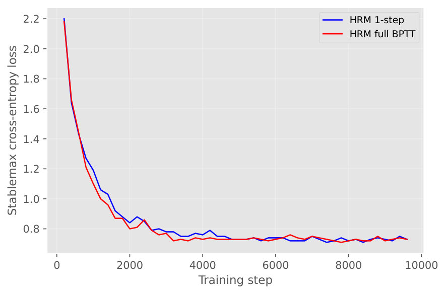
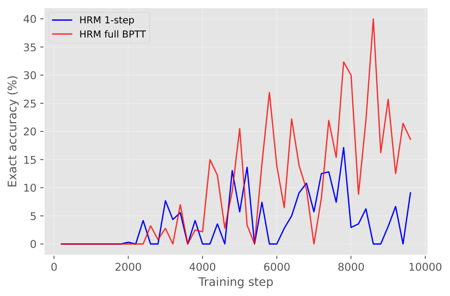

# When Better Gradients Hurt: The Gradient-Architecture Interaction in Recursive Reasoning

**Paper 2 of the 2×2 disentanglement series**  
Completing the factorial: HRM's dual-network hierarchy at both gradient methods reveals an unexpected interaction effect.

**Paper:** [arXiv:XXXX.XXXXX]  
**Author:** Jatin Jani, Independent Researcher

---

## TL;DR

We complete the 2×2 factorial design left open by prior work. The result is counterintuitive: while full BPTT improves flat architectures by 8.6× (2.2% → 18.9%), it *degrades* HRM's hierarchical architecture (9.2% → 8.7%). Better gradients do not universally improve performance. Architecture and gradient method have a strong, previously undocumented interaction effect.

## The Completed 2×2 Matrix

|                     | Dual H/L (HRM)          | Single flat (TRM)        |
|---------------------|--------------------------|--------------------------|
| **1-step (O(1))**   | 68.8% / **9.2%**         | 65.9% / 2.2%             |
| **Full BPTT (O(T))**| 69.3% / **8.7%**         | 71.6% / 18.9%            |

*Token accuracy / Exact accuracy (exact in bold). TRM results from prior work.*

## Key Findings

1. **Gradient quality is not universally beneficial.** Full BPTT boosts flat architectures but provides zero benefit, and may slightly harm, hierarchical architectures.

2. **Hierarchy compensates for poor gradients.** Under the 1-step gradient, HRM (9.2%) outperforms flat TRM (2.2%) by 4.2×, despite no EMA and a comparable parameter budget.

3. **The interaction is crossover.** Under 1-step gradients, HRM dominates TRM. Under full BPTT, TRM dominates HRM. There is no universally superior combination.

4. **Full BPTT overfits on hierarchical architectures.** Training-set exact accuracy reaches 32–40% with full BPTT versus 9–17% with 1-step, yet test accuracy is *worse* (8.7% vs 9.2%).

## Repository Structure

```
├── paper/                                 # LaTeX source + figures
│   ├── paper.tex
│   ├── references.bib
│   ├── arxiv.sty
│   └── plots/
│       ├── loss.pdf                      # Training loss curves
│       └── exact.pdf                     # Training exact accuracy
├── notebooks/                             # Kaggle training notebooks
│   ├── hrm_1step_final.ipynb             # Clean: HRM + 1-step gradient
│   ├── hrm_1step_executed.ipynb          # Executed: with results
│   ├── hrm_fullbp_final.ipynb            # Clean: HRM + full BPTT
│   └── hrm_fullbp_executed.ipynb         # Executed: with results
├── logs/                                  # Full training logs
│   ├── hrm_1step.log                     # ~10K lines, 1-step run
│   └── hrm_fullbp.log                    # ~10K lines, full BPTT run
├── checkpoints/                           # Final model weights (step_9765)
│   ├── hrm_1step_final/
│   │   ├── step_9765                     # 54 MB
│   │   └── resume_info.json
│   └── hrm_fullbp_final/
│       ├── step_9765                     # 54 MB
│       └── resume_info.json
├── config/                                # Training configuration
│   ├── cfg_pretrain.yaml                 # Main config (Hydra)
│   └── hrm_v1.yaml                       # Architecture config
├── patches/
│   └── gradient_patch.diff               # Exact code change for full BPTT
├── README.md
└── LICENSE
```

## Reproduction

### Quick start
1. Upload `notebooks/hrm_1step_final.ipynb` to Kaggle with 2× T4 GPU
2. Upload `notebooks/hrm_fullbp_final.ipynb` to Kaggle with 2× T4 GPU
3. Run all cells. Training takes ~4.5h (1-step) and ~6h (full BPTT).
4. The eval cell outputs accuracy numbers at the end.

### Details
- **Base code:** [sapientinc/HRM](https://github.com/sapientinc/HRM)
- **Dataset:** Sudoku-Extreme from [sapientinc/sudoku-extreme](https://huggingface.co/datasets/sapientinc/sudoku-extreme)
- **Hardware:** 2× NVIDIA Tesla T4 (16GB), PyTorch 2.10, CUDA 12.8
- **Training:** 10,000 epochs, 500+500 examples, bfloat16, AdamW, ACT
- **Gradient patch:** See `patches/gradient_patch.diff`, which removes `torch.no_grad()` from the recurrent loop
- **Resume:** Checkpoints saved every 500 steps with automatic resume on restart

### Evaluate from checkpoints
```python
import glob, json, torch
from models.losses import ACTLossHead
from utils.functions import load_model_class

ckpt = torch.load("checkpoints/hrm_1step_final/step_9765", map_location="cuda")
# Load model and evaluate (see notebook eval cell for full code)
```

## Training Configuration

| Parameter | HRM 1-step | HRM full BPTT |
|-----------|------------|---------------|
| Model | HRM ACT-V1 (dual H/L) | HRM ACT-V1 (dual H/L) |
| Gradient | 1-step (O(1) memory) | Full BPTT (O(T) memory) |
| Hidden size | 384 | 384 |
| H_layers / L_layers | 4 / 4 | 4 / 4 |
| H_cycles / L_cycles | 2 / 2 | 2 / 2 |
| ACT halt steps | 16 | 16 |
| Batch size | 512 | 512 |
| Epochs | 10,000 | 10,000 |
| Precision | bfloat16 | bfloat16 |
| Results | 68.8% / **9.2%** | 69.3% / **8.7%** |

## Gradient Patch

The full BPTT variant makes one code change to `models/hrm/hrm_act_v1.py`:

```python
# Original HRM (1-step gradient):
with torch.no_grad():
    z_H, z_L = carry.z_H, carry.z_L
    for _H_step in range(H_cycles):
        for _L_step in range(L_cycles):
            if not last_step: z_L = L_level(z_L, z_H + x)
        if not last_cycle: z_H = H_level(z_H, z_L)
z_L = L_level(z_L, z_H + x)    # Only step with GRAD
z_H = H_level(z_H, z_L)

# Full BPTT (our patch):
z_H, z_L = carry.z_H, carry.z_L
for _H_step in range(H_cycles):
    for _L_step in range(L_cycles):
        z_L = L_level(z_L, z_H + x)   # GRAD
    z_H = H_level(z_H, z_L)           # GRAD
```

Additional patches applied to match the controlled training budget:
- `adam-atan2` → `AdamW` (T4 hardware compatibility)
- `flash_attn` → PyTorch `F.scaled_dot_product_attention` fallback (T4 lacks flash-attn)
- `.view()` → `.reshape()` (non-contiguous tensor fix for SDPA)

## Training Curves




The 1-step and full BPTT variants show nearly identical training dynamics on the hierarchical architecture, unlike the flat architecture where full BPTT dramatically outperforms.

## Citation

```bibtex
@article{jj2026interaction,
  title={When Better Gradients Hurt: The Gradient-Architecture Interaction in Recursive Reasoning},
  author={Jani, Jatin},
  journal={arXiv preprint},
  year={2026}
}
```

## License

MIT. See [LICENSE](LICENSE).  
Code based on [sapientinc/HRM](https://github.com/sapientinc/HRM) (MIT).
